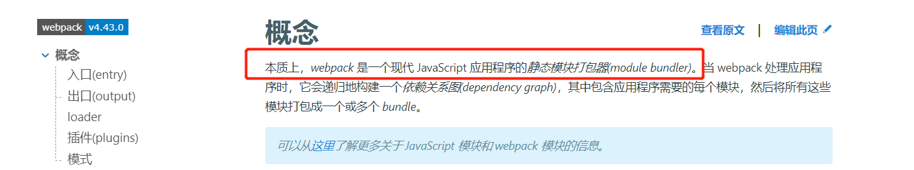
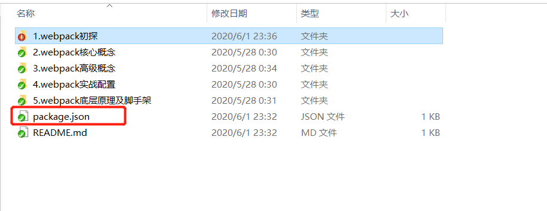
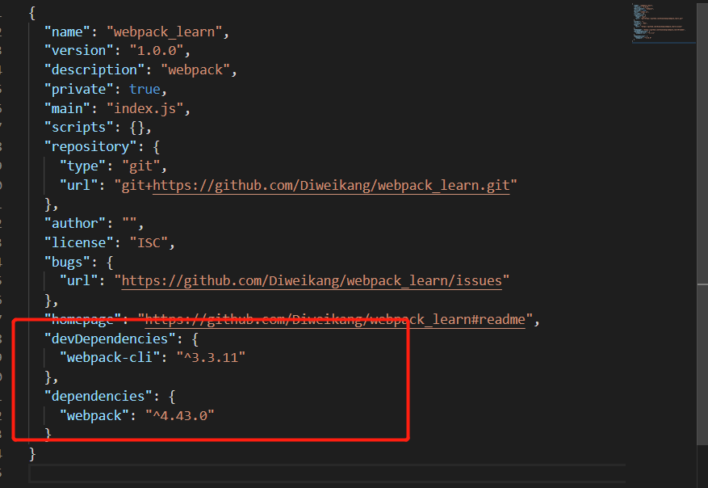
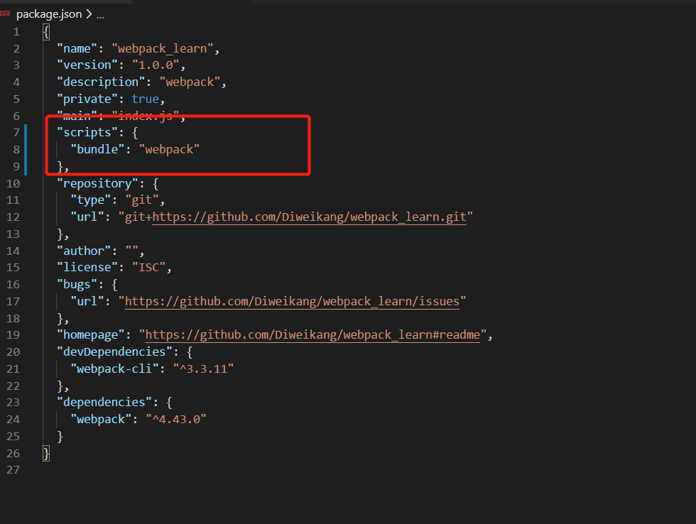

#### webpack初探
##### 1. 什么是webpack
官网中对webpack的描述，webpack是静态模块打包工具。

##### 2. webapck初体验
- node项目初始化
  - 命令：npm init
  然后根据提示一路yes，然后项目就初始化成功了。
  - 或者 npm init -y
  这样表示初始化项目都是用默认配置，不需要一路yes。
  - 运行结果
  生成一个带有package.json文件的项目。
  

- 安装webpack、webpack-cli依赖
  - webpack
    对资源模块进行打包的核心库。
  - webpack-cli
    保证webpack命令可以在CMD中运行。
  - 安装指定版本的依赖，通过@符指定版本
    npm install xx@xxx
  - 命令：npm install webpack webpack-cli -S
    1. 目录中会生成一个node_modules文件夹，存放安装的依赖。
    
    1. package.json中会记录webapck和webpack-cli的安装记录。
    
    
  - 如何查看依赖包版本
    - npm view webpack
      查看**最新版本**的webpack信息
    - npm view webpack versions
      查看所有webpack历史版本
    - npm view webpack versions --json
      以json的形式输出webpack所有的历史版本信息。

- webpack编译打包JS
  - 命令： npx webpack index.js
  对入口js文件进行打包，打包完后默认会在根目录下生成一个/dist/main.js文件。
    - npx命令作用
      首先会从当前项目中的node_modules中查找是否有webpack依赖。
    - webpack命令作用
      真正进行打包的命令
    - index.js
      需要进行打包的文件
    - **注意**：为什么我们不编写配置文件，webpack依然可以正确打包呢？
      webpack本身内置了默认的配置文件，这里使用的就是默认的配置进行打包。

##### 3.webpack正确安装和使用
为了保证webpack的打包速度，应该尽可能使用新版本的node和webpack。
1. 如何正确安装
   - 避免全局安装
      如果不同的项目使用不同版本的webpack，全局安装就会导致版本不匹配的项目无法编译打包。
   - 使用项目中局部安装
      针对不同项目安装不同版本webpack，在cmd中可以使用npx webpack运行操作。

2. webpack配置文件
  - 文件名(默认配置文件名)
    创建webpack.config.js文件，在项目目录下运行npx webpack，文件就会打包成功。
    - 文件名非webpack.config.js
      运行 npx webpack --config xxx.js，通过--config指定具体的配置文件
     

3. 使用npm中的script简化打包操作
  - 在package.json文件中有"scripts": {}配置项
    配置：{bundle: 'webpack'}
    
  - 在cmd中运行npm run bundle
    这样就使用script的配置，实现运行npm run ** 进行打包。
  - 在script中使用webpack命令，默认在当前项目查找webapck依赖，而非全局环境。

4. 打包模式
   - mode: production
    默认为production生产环境，打包出来的js文件会被压缩。
   - mode: development
    声明mode为development开发环境时，打包出来的js文件不会被压缩。