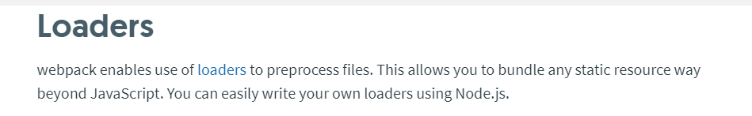
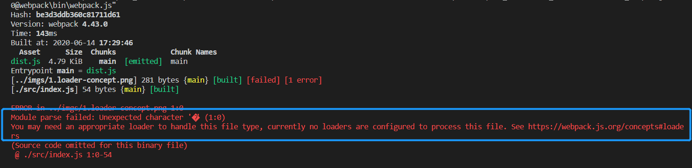
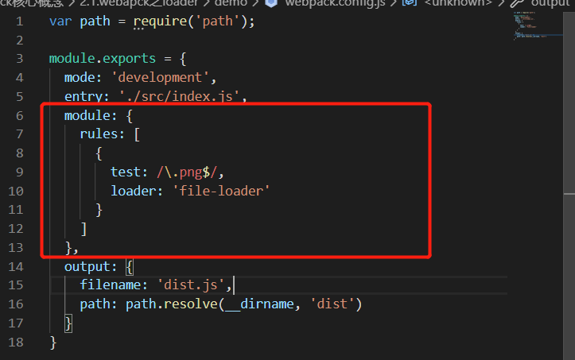
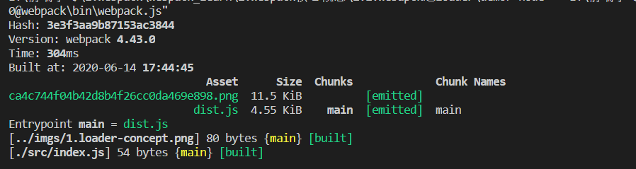
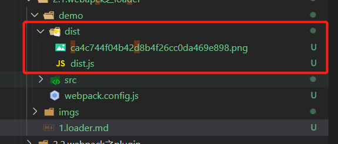
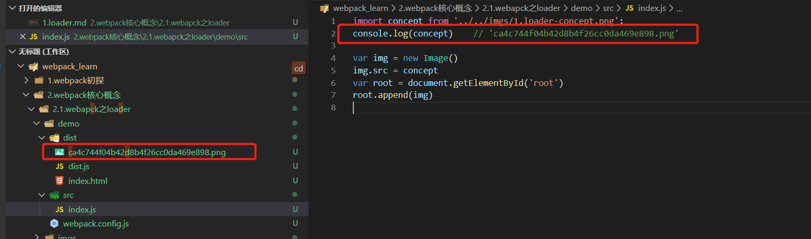
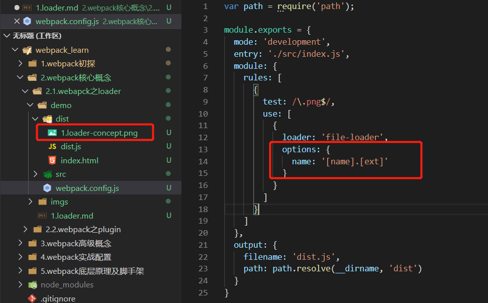
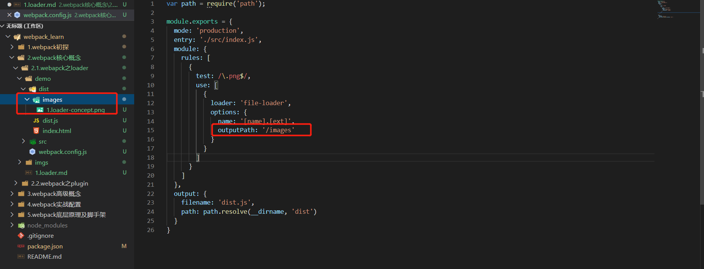

#### webpack核心之loader
webpack默认会对以.js结尾的文件进行打包，如果需要对非.js结尾的文件进行打包，就需要loader的辅助。
##### 1. 什么是loader
官网中对loader的描述，webpack可以使用loader对文件进行'预处理'，允许打包除JavaScript之外的所有静态资源。


##### 2. loader初体验
###### 2.1 loader打包图片文件
如果我们还按照跟js文件一样对**图片**进行引入然后打包，此时就会报错。
- 打包图片文件
  1. 编写index.js文件，引入图片文件
    
  2. 然后运行命令npx webpack，此时就会报错。
    
    错误中提示需要使用loader去处理此类文件。
  3. 通过命令安装**file-loader**。
    ```
      npm install file-loader -D
    ```
  4. 在webapck.config.js中配置file-loader。
    
  5. 再次运行npx webpack编译，打包结果正确并生成对应的dist目录。
    
  6. 打包生成的对应的dist目录。
    
    **注意**：
      对于生成的复杂的图片文件名是可以配置的，在下文会讲到。
- 打包过程
  - 运行命令npx webpack
    1. webpack会根据webpack.config.js进行配置打包，如果遇到.js文件webpack本身就知道如何进行打包。
    2. 当遇到.png文件时，配置文件中module配置项告诉webapck使用file-loader进行打包。
    3. file-loader知道如何对.png文件进行打包，首先会将需要打包的文件拷贝到对应的dist文件中，并且将文件在dist中的文件名返回给引入的变量。
      

- file-loader配置选项
  默认生成的文件名是文件内容的 MD5 哈希值和原始文件扩展名，默认生成的文件名很不友好，我们可以通过配置选项进行修改。
  - 选项：name
    - 常用占位符
      - name 
        资源基本名称
      - ext
        资源扩展名
    - 配置webapck.config.js修改生成文件名称。
      
    - 设置文件生成路径
      如果不希望文件打包生成在dist根目录下，可以通过outputPath进行配置。
      
   
    