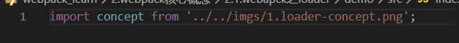

#### webpack核心之loader
webpack默认会对以.js结尾的文件进行打包，如果需要对非.js结尾的文件进行打包，就需要loader的辅助。
##### 1. 什么是loader
官网中对loader的描述，webpack可以使用loader对文件进行'预处理'，允许打包除JavaScript之外的所有静态资源。


##### 2. loader初体验
###### 2.1 loader打包图片文件
如果我们还按照跟js文件一样对**图片**进行引入然后打包，此时就会报错。
- 打包图片文件
  1. 编写index.js文件，引入图片文件
    
  2. 然后运行命令npx webpack，此时就会报错。
    
    错误中提示需要使用loader去处理此类文件。
  3. 通过命令安装**file-loader**。
    ```
      npm install file-loader -D
    ```
  4. 在webapck.config.js中配置file-loader。
    
  5. 再次运行npx webpack编译，打包结果正确并生成对应的dist目录。
    
  6. 打包生成的对应的dist目录。
    
    **注意**：
      对于生成的复杂的图片文件名是可以配置的，在下文会讲到。
- 打包过程
  - 运行命令npx webpack
    1. webpack会根据webpack.config.js进行配置打包，如果遇到.js文件webpack本身就知道如何进行打包。
    2. 当遇到.png文件时，配置文件中module配置项告诉webapck使用file-loader进行打包。
    3. file-loader知道如何对.png文件进行打包，首先会将需要打包的文件拷贝到对应的dist文件中，并且将文件在dist中的文件名返回给引入的变量。
      

- file-loader配置选项
  默认生成的文件名是文件内容的 MD5 哈希值和原始文件扩展名，默认生成的文件名很不友好，我们可以通过配置选项进行修改。
  - 选项：name
    - 常用占位符
      - name 
        资源基本名称
      - ext
        资源扩展名
    - 配置webapck.config.js修改生成文件名称。
      
    - 设置文件生成路径
      如果不希望文件打包生成在dist根目录下，可以通过outputPath进行配置。
      
   
- url-loader
  url-loader功能类似file-loader，当打包的文件大小小于设置的限制时，返回一个DataURL。
  - 替换file-loader打包图片
    1. 安装url-loader依赖
    ```
      npm install url-loader -D
    ```
    2. 配置webpack.config.js
    
    这样打包后，dist目录中就不会再有单独的图片文件。图片文件会以base64形式的字符串保存。
    
    
    3. url-loader配置选项
      - 优点
        使用url-loader对图片打包后，不会再dist目录中生成单独的图片，图片会以base64的形式打包到.js中，这样页面在加载图片的时候就会减少一次http请求。
      - 缺点
        如果图片相对比较大，就会导致js文件偏大，这样页面的加载就需要耗费更多的时间。
      - 解决方法：
        1. 当图片大小小于一定值时候，救将图片以base64的形式进行打包存储。
        2. 当图片大于等于某个值时，还是生成一个新图片。
      - limit选项
        url-loader中的limit选项就可以很好的解决上面的问题。
        - 配置limit选项
          
          由于我们原图大小为18kb，所以最后打包生成了新的图片。
        - 修改limit值为18kb
          
          当我们修改limit大小为18kb时，打包后图片就以base64的形式存储。
          

###### 2.1 loader打包样式文件
  学习了图片文件的打包，那么对于css/less/scss等样式文件如何进行打包呢。
  - css
    1. 编写index.css文件，在index.js中引入index.css文件，编译打包时候报错。
      
      错误中提示需要正确的loader去处理css类型文件。
    2. 安装style-loader和css-loader。
    ```
      npm install style-loader css-loader -D
    ```
     - style-loader
        负责将css文件注入到html的head中。
     - css-loader
        css-loader会分析互相引用的css之间的关系，并将所有的css进行合并压缩为一个。
    3. 配置style-loader和css-loader。
      
      我们可以看到页面上的图片尺寸已经改变了。
      
  - scss/less
    1. 以scss为例，将index.css文件修改为index.scss文件，并将样式结构改为scss结构。
      
    2. 修改webpack.config.js文件配置
      
    3. 运行命令进行打包，打包后发现页面样式并没有起作用，浏览器并不认识scss语法。
      
    4. 要想对scss文件进行编译，安装sass-loader和node-sass。
    ```
      npm install sass-loader node-sass -D
    ```
    5. 修改webpack.config.js配置。
    style-loader负责将scss语法编译成css语法。
    
    webpack中loader的执行顺序是从下到上/从右到左。
    6. scss文件编译成功
    
    至此关于scss文件的编译打包就完成了。

- 关于css3新属性
  一般我们写css3时都需要添浏览器厂商前缀，比如：webkit, mozila, IE等对浏览器进行适配支持。但是我们手动去编写就会很麻烦，这时我们就可以借助postcss-loader实现自动添加厂商前缀的功能。
  1. 修改index.scss文件，添加css3样式。
    
  2. 安装postcss-loader依赖
    ```
      cnpm install postcss-loader -D
    ```
  3. 在根目录下新建postcss.config.js文件。
  配置自动引入前缀插件，autoprefixer。
    
  4. 安装autoprefixer插件。
  ```
    cnpm install autoprefixer -D
  ```
  5. 运行命令重新进行打包，我们可以看到打包好的css3属性就带有浏览器的厂商前缀了。
  
  6. **注意**
  我们需要在package.json中配置browserslist选项，限制浏览器版本。
  
  如果不配置browserslist选项，使用autoprefixer编译结果css3不会加上浏览器厂商前缀。
- css-loader常用配置项
  1. importLoaders选项
    - 问题
      在index.js中引入的index.scss在编译打包的时候会依次经过poscss-loader\scss-loader\css-loader\style-loader的编译处理。但是在index.scss中通过@import引入的其他scss文件就只经过css-loader和style-loader的编译处理。这个时候就需要借助css-loader中的importLoaders选项。
    - 作用
      用于配置「css-loader 作用于 @import 的资源之前」有多少个 loader。


  


    