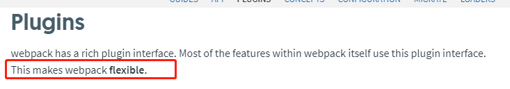

#### webpack核心之plugin(插件)
插件的使用会使webpack的打包变得更加的便捷灵活。

##### 1. HtmlWebpackPlugin插件
作用：会在打包后的目录中生成一个.html文件。
  1. 默认打包
     - 安装HtmlWebpackPlugin
     ```
       cnpm install html-webpack-plugin -D
     ```
     - 在webpack.config.js中添加plugins配置
     
     - 运行命令npm run bundle进行编译打包
     
     - 打包结果
     
     HtmlWebpackPlugin 会在打包结束后，自动生成一个html文件，并把生成的.js文件自动引入到这个html文件中。
  2. 指定模板
    HtmlWebpackPlugin默认生成的html结构不一定是我们想要的，这个时候我们就可以借助template选项指定html模板。
 - 在src下创建index.html
   
 - 修改webpack.cofnig.js配置
   
 - 运行命令编译打包，结果如下
   

##### 2. CleanWebpackPlugin插件
  作用：在打包前先删除之前打包生成的目录。
  
  - 安装插件
  ```
    cnpm install clean-webpack-plugin -D
  ```
  - 修改webpack.config.js文件
  
  这样在打包之前会先删除之前打包生成的目录。