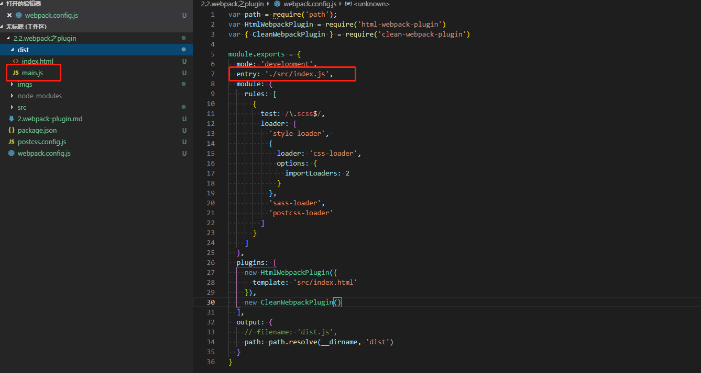
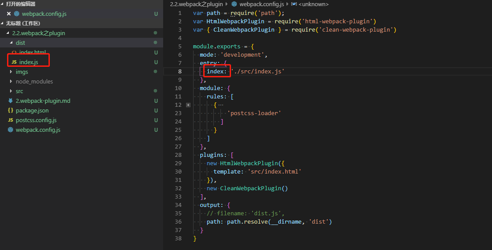
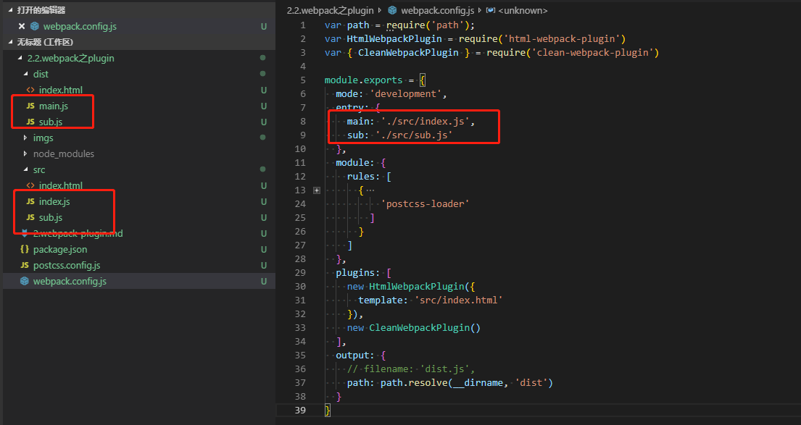
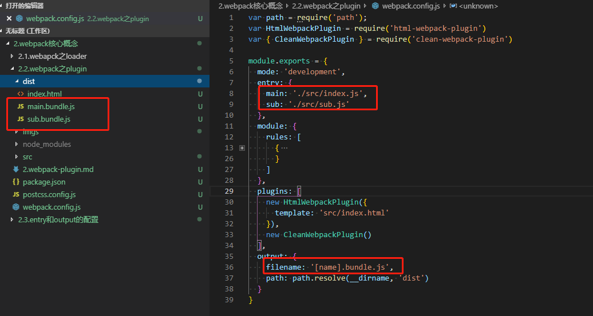
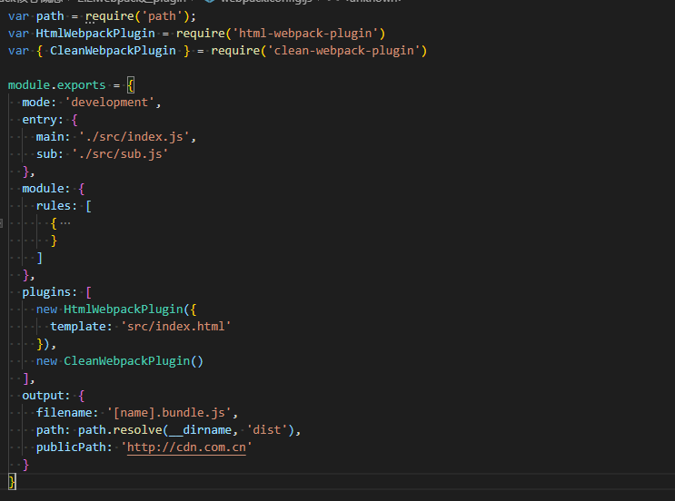
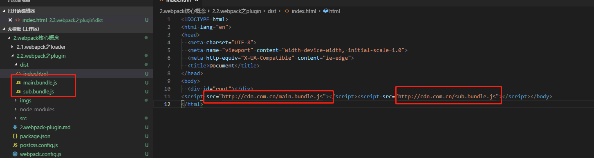

#### webpack核心之entry和output的基础配置
entry和output分别是webpack打包的入口和出口配置项。
##### 1. entry配置
webpack打包入口
  1. 基本配置
     
  打包生成的js默认为main.js。
  ```
    module.exports = {
      entry: 'src/index.js'
    };
  ```
  其实是下面写法的缩写
  ```
    module.exports = {
      entry: {
        main: 'src/index.js'
      }
    }
  ```
  如果不配置output中的filename的选项，那么entry中的key就是打包生成的js文件名。
  
   
  2. 多入口配置
  
  对应的output配置可以进行修改
  

##### 2. output配置
打包后文件中的index.html一般会作为后端入口文件，我么可以将js文件上传到cdn上。这个时候index.html中通过script引入的.js文件就需要加上cdn域名前缀了。
- publicPath选项
  
- 打包后index.html结果
  