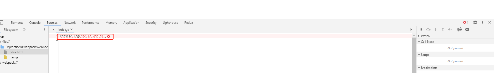

#### sourceMap的配置
控制代码中的编码错误如何进行提示。
##### 1. 基本配置
- 编写index.js文件
```
  consele.log('hello world!')
```
index.js中只是简单的输出'hello world'，但是我们故意写错'consele'。
- 配置webpack.cofnig.js文件

- 运行命令编译打包
```
  npm run bundle
```
- 打开打包后dist中的index.html文件

控制台中报错，并且报错指向的是src目录下的index.js中的第一行。
  - 疑问
  打包后的index.html中的引入的明明是dist目录中的main.js，为什么报错不是指向main.js中的错误位置，而是指向了src目录下的index.js中。
  
  - 原因
  在'development'模式下默认开启了sourceMap的配置，所以最后指向了src目录下的index.js。
  
##### 2. 关闭sourceMap配置
- 修改webpack.config.js配置

- 运行命令编译打包
```
  npm run bundle
```
- 打开打包后dist中的index.html文件
  
  控制台中报错，并且报错指向了dist目录下的main.js中的第96行。
- 结果
  编码中出现错误，我们希望错误是在源代码中提示，而不是在打包后的代码中提示来。所以一般来说我们是要开发sourceMap的配置。

##### 3. 开启sourceMap配置
- 配置source-map
  - 修改webpack.config.js配置
    
  - 运行命令编译打包
    ```
      npm run bundle
    ```
  - 打开打包后dist中的index.html文件
    
    控制台报错位置指向了src中的index.js中，是我们所期望的。
  - dist目录中生成了main.js.map文件
    这个文件维护了dist/main.js和src/index.js文件之间的映射关系。
  - 弊端
    开启devtool: 'source-map'配置后，打包速度会相应的变慢，因为要去构建源代码和打包后代码的映射关系。
    
  - 前缀
    source-map前可以用很多前缀，如：inline、cheap、eval等，这些前缀都可以进行自由组合。

- 配置inline-source-map
  inline作用，主要将.map.js文件直接打包到main.js文件中。
  - 修改webpack.config.js配置
    
  - 打包后dist目录中少main.js.map文件
    配置inline-source-map时，map.js文件会被编译成一个base64的字符串。main.js.map会通过dataUrl的形式直接写入main.js文件中。
    
- 配置cheap-source-map
  - cheap作用
    1. 主要是简化错误的提示，当代码量很大时错误一般会提示在X行X列，但是这样会降低打包的性能，cheap会简化错误只提示到X行。
    2. 添加cheap后，只会映射业务代码之间的关系，对于第三方依赖包代码不会进行映射。