#### webpack-dev-server的配置
在之前的练习中，每次修改完webpack.config.js后都需要重新运行命令进行编译，这样很影响开发效率，那么如何去解决呢？
##### 1. watch配置项
在webpack.config.js中添加watch配置选项，可以监控文件的改变，当文件改变的时候可以进行重新编译。
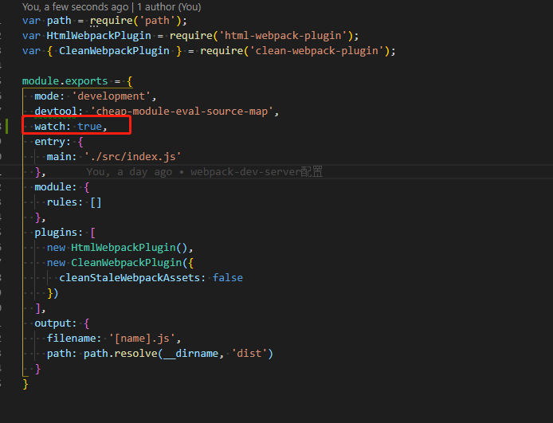
配置watch选项后，每次更新index.js后，只要保存就会完成重新编译。
- 缺点
  1. 编译完成后index.html无法直接在浏览器中打开，需要手动打开。
  2. 文件修改后需要重新刷新页面才能看到变化。

##### 2. webpackDevServer配置
webpack-dev-server可以解决我们使用watch遇到的问题。
- 安装webpack-dev-server
  ```
    cnpm install webpack-dev-server -D
  ```
- 配置webpack.config.js文件
  - contentBase
    表示devServer服务器启动的根目录。
  - open选项
    表示编译完成后自动在默认浏览器打开页面
  - port
    表示服务启动的端口，默认为8080。
  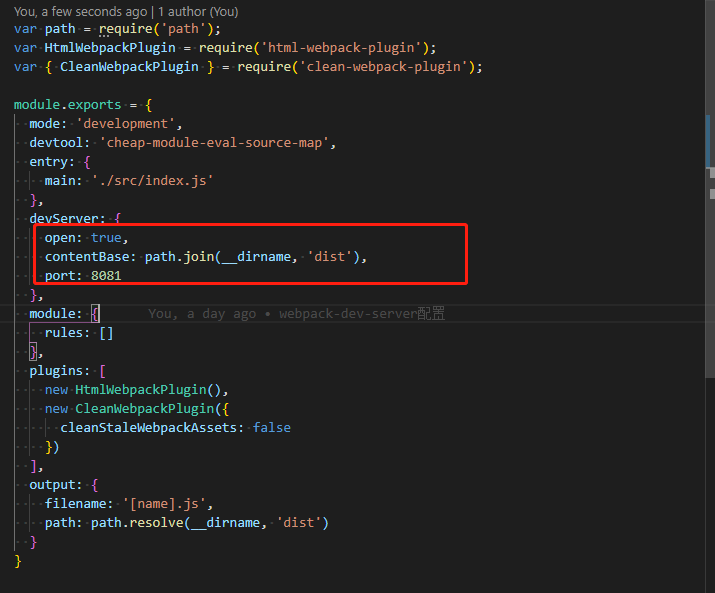
- 在package.json中添加script
  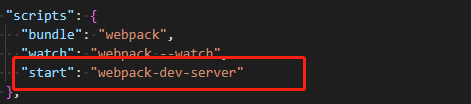
- 运行命令
  ```
    npm run start
  ```
  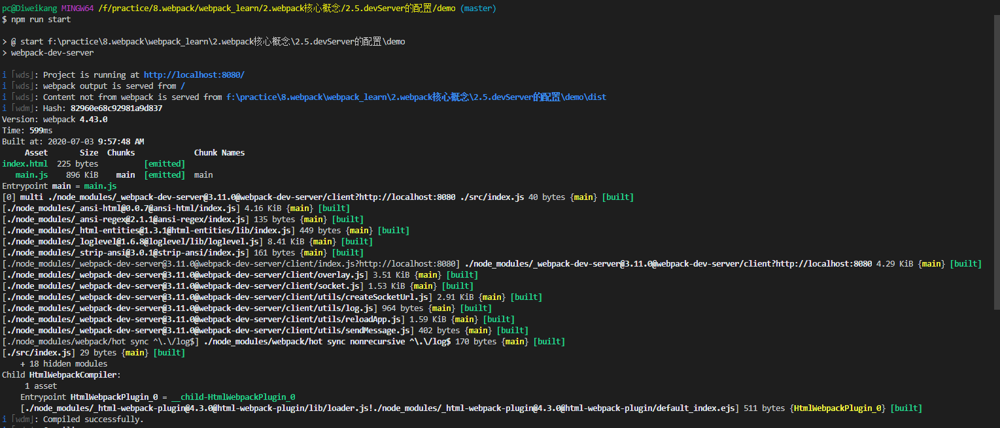
- 编译运行结果
  1. 页面在浏览器中默认启动打开。
  2. 修改index.js后，自动完成编译并且浏览器自动进行刷新。
  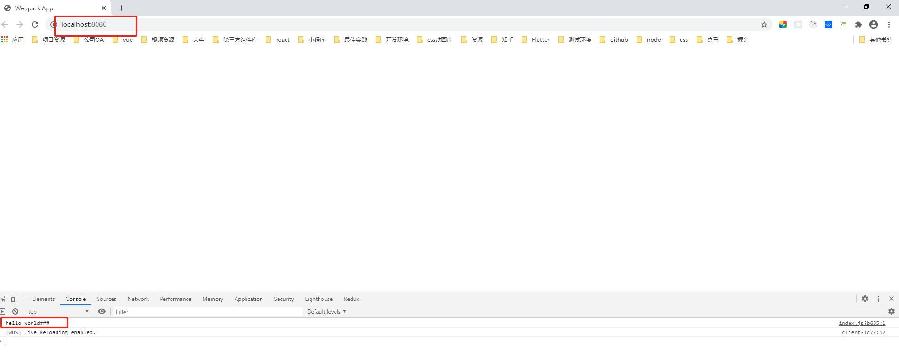

##### 3. webpack-dev-middleware配置
我们可以使用express和webpack-dev-middleware实现简易版的webpack-dev-server。
- 安装express和webpack-dev-middleware。
```
  cnpm install express webpack-dev-middleware -D
```
- 在src的同级目录下新建server.js文件
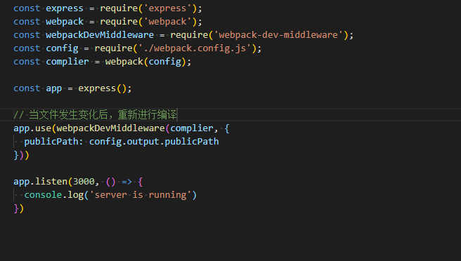
- 在webpack.config.js的output选项中添加publicPath选项
  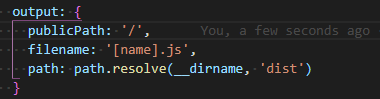
- 在package.json中添加script短命令
  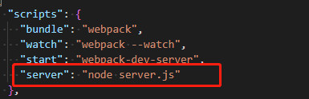
- 运行命令进行编译打包
  ```
    npm run server
  ```
  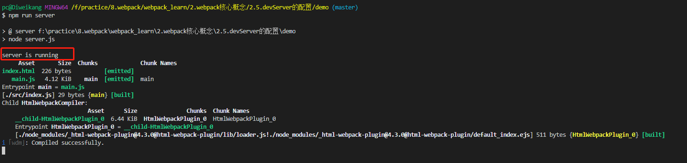
- 在浏览器中访问localhost:3000
  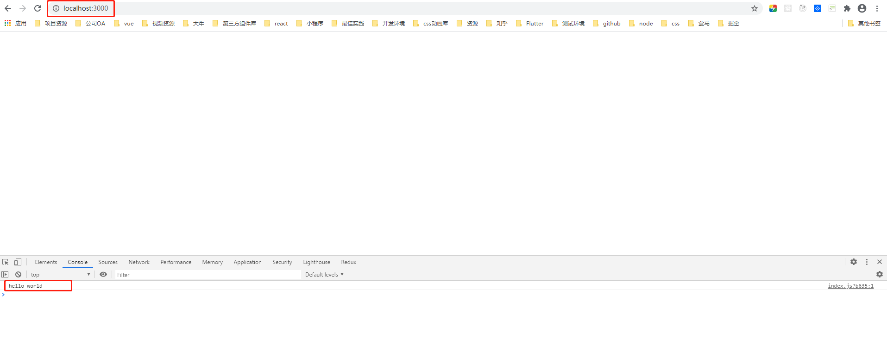
- 修改index.js中代码，保存后重新保存。
  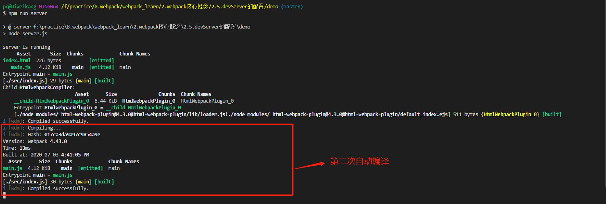
  刷新浏览器查看控制台内容
  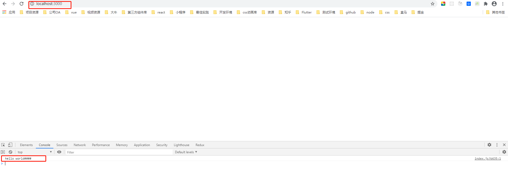

##### 3. Hot Module Replacement的配置
热模块更新，简称HMR。
- 局部更新css样式
  - 编写index.js文件
  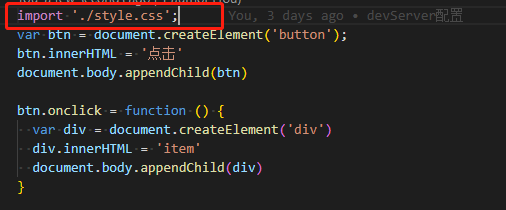
  - 编写style.css文件
  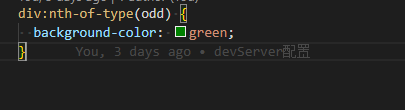
  - 运行编译打包命令
  ```
    npm run start
  ```
  - 点击按钮查看结果
  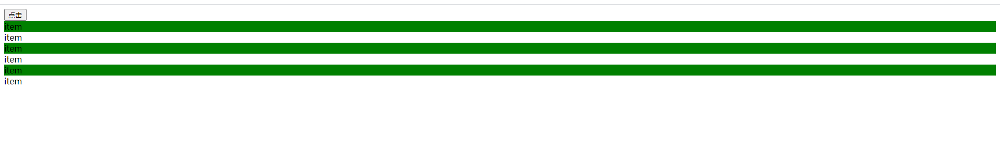
  当点击按钮后就会生成div元素，同时所有偶数div元素都有背景色。
  - 修改style.css中的背景色
    1. 结果：浏览器刷新所有之前新建的div元素都消失了
    
    1. 期望：我们只希望div样式进行切换，而不是所有的元素都丢失。
    2. 这就需要开启webpack的**热模块更新**
  - 修改webpack.config.js文件配置
  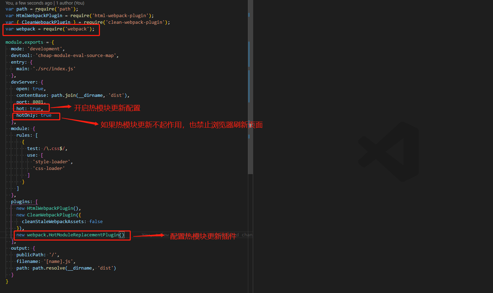
  - 开启热模块更新后，再次修改style.css中元素背景色
  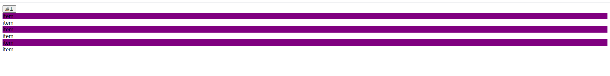
  我们可以看到页面只是更新了对应div的样式，页面并没有更新元素并没有丢失。

- 局部更新js内容
  - 编写counter.js文件
  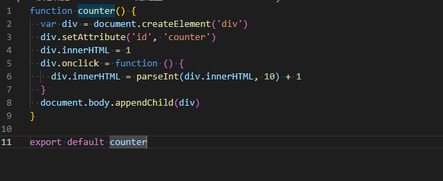
  - 编写number.js文件
  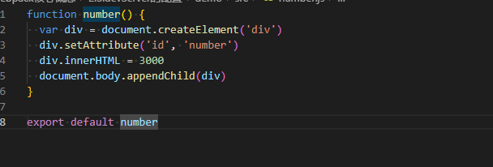
  - 编写index.js文件，引入counter.js和number.js文件，并执行相应的方法。
  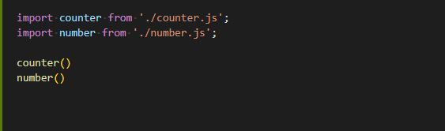
  - 运行命令编译打包代码
  ```
    npm run start
  ```
  - 点击第一个div改变数值
  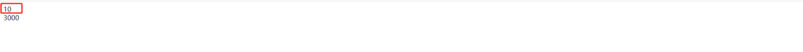
  - 修改number.js文件中的数值，保存后重新编译
  我们将number中的3000改为1000。
  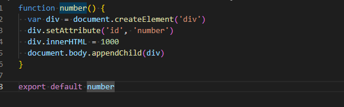
  但是浏览器中数字并没有变成1000。
  
  - 修改index.js文件
  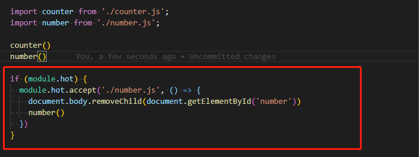
  当number文件发生变化时，重新执行number()函数。
    - 注意：
      webpack.config.js需要和上文一致。
      
  至此我们就完成了webpack中热模块更新的配置。
- 总结：为什么在局部更新css时，我们不需要写类似js中那一坨代码呢？
  因为css-loader中其实已经帮我们实现了那一段代码。