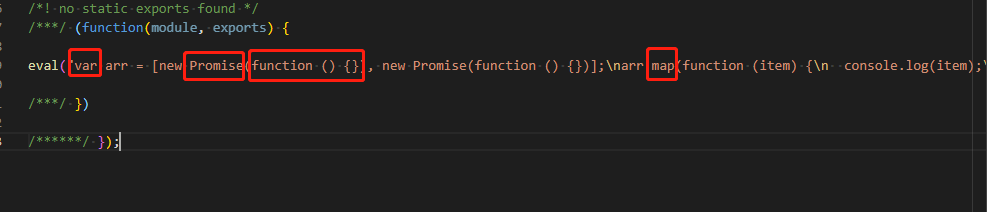

#### webpack中配置babel解析ES6语法
如果在项目中我们想使用ES6等之后的语法，我们就需要借助babel将ES6语法转换成ES5。
##### 1. 正常ES6代码编译打包结果
- 在src目录下，编写index.js文件
  
- 运行命令编译打包
  ```
    npm run bundle
  ```
- 查看dist目录下生成main.js代码
  
  我们可以看到打包后还是原来的ES6语法，如果我们想ES6转换为所有浏览器都支持的ES5语法，就需要借助babel。

##### 2. webpack中配置babel
- 安装babel-loader和@babel/core
  ```
    cnpm install babel-loader @babel/core -D
  ```
  - babel-loader
    帮webpack进行打包时所使用的工具。
  - babel/core
    是babel的核心库，能让babel识别js里的内容，然后将js代码转为AST抽象语法树，然后再将抽象语法树编译转化成新的语法。
- 在webpack.config.js中添加loader选项
  
- 安装@babel/preset-env
  将js中的ES6语法转换为ES5语法，包含了所有ES6转换为ES5的转换规则。
  ```
    cnpm install @babel/preset-env -D
  ```
- 配置@babel/preset-env选项
  
- 运行命令编译打包
  ```
    npm run bundle
  ```
  
  上图中我们看到源代码中的const转成了var，箭头函数转成了普通函数，但是promise和map并没有转换，这个如何处理呢？这就需要借助polyfill了。

- 安装@babel/polyfill
  ```
    cnpm install @babel/polyfill
  ```
- 在index.js中引入polyfill。
  
  引入polyfill后，打包后polyfill会把promise和map的实现打包进main.js文件中。
  
  打包后明显能看到main.js文件体积很大，因为不光打包了promise和map的实现，同时也把其他的变量/函数实现一并打包进main.js文件了。这个时候就需要借助配置实现按需打包。
- 按需打包引入
  
- 再运行命令编译打包
  
  从结果中我们可以看到main.js体积从989kb变成了157kb，只会将promise和map的实现打包进main.js中，这就实现了我们的按需引入。
  
##### 3. webpack中配置babel-进阶
- targets选项
  配置浏览器的版本，如果配置的版本以上的浏览器都支持了ES6语法，那么就会忽略掉ES6转ES5的操作。
  
  如果打包过程发现chrome67版本以上的浏览器都完全支持ES6语法了，那么编译过程中就会忽略掉ES6转ES5的转换。
- transform-runtime的配置
  如果在开发类库或者第三方模块时，再使用上面polyfill的模式就会存在问题，polyfill在注入promise等变量时是通过全局变量的方式，这就会污染全局环境。
