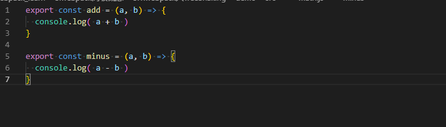
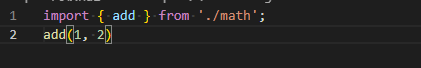
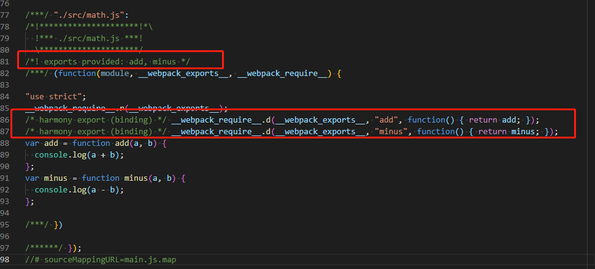
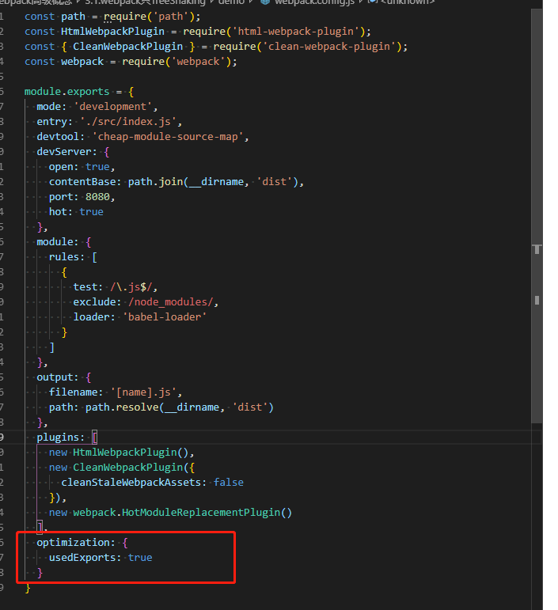
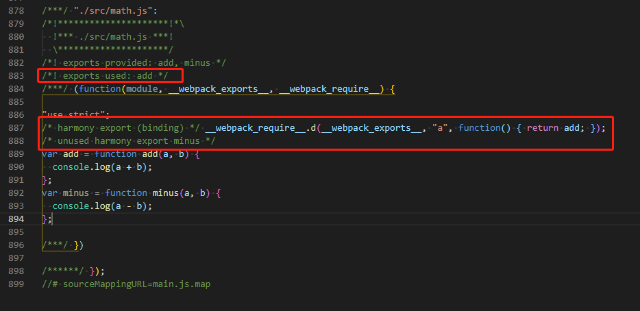
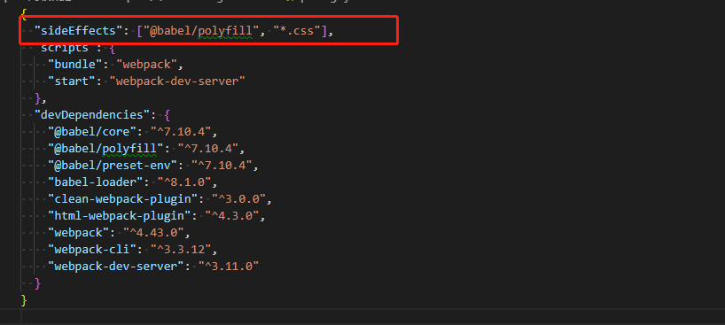

#### webpack中TreeShaking的配置
项目中当我们引入一个模块时，我们可能只使用模块中个别的方法，而无需将模块中所有的方法都进行打包编译，此时我们就需要借助webpack中的TreeShaking。
##### 基础配置打包
- 在src目录中创建math.js文件

- 在src目录中创建index.js文件
  
  在index.js文件中引入了math.js文件，同时只调用了add方法，并没有调用minus方法。那么希望打包后的结果中只引入add方法，而不引入minus方法。
- 运行编译打包命令
  ```
    npm run bunlde
  ```
- 查看打包后dist目录中main.js文件
  
  上图中我们可以看到math.js中的add和minus方法都被打包应用到了main.js文件中，并没有达到我们的期望，此时就需要借助Tree Shaking来完成我们的按需引入。

##### 引入TreeShaking配置
- 修改webpack.config.js文件
  
  在webpack.config.js中添加optimization选项，表示哪些导出的模块被使用了再做打包。
- 运行命令编译打包
  
  1. 结果中多了'exports used: add'的注释
  2. 'harmony export (binding)'中只有add方法的exports，并没有minus方法的exports。
  3. 我们期望的可能是编译后在main.js中删除掉minus方法，但是在**开发模式**下生成的代码是需要做调试的，如果将minus方法直接从main.js中删除掉，那么在做调试的时候可能会导致sourcemap在做映射时出现问题。
- 注意事项
  1. treeShaking配置只使用与EsModule语法，因为EsModule语法底层是静态的引入方式。
  2. 对于没有导出结果的模块，需要在package.json中添加sideEffects进行配置过滤，比如：@babel/polyfill或者.css的文件，因为没有导出结果在使用TreeShaking模式打包时有可能会被忽略，那我们就要避免这些依赖使用TreeShaking的模式进行打包。
  
  3. 在'production'中无需在webpack.config.js中添加optimization配置项，并且未使用的模块方法不会打包到目标文件中。