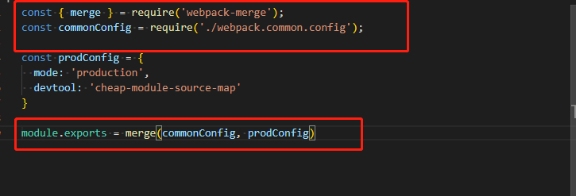

#### webpack中的mode配置选项
webpack中的mode有'development'和'production'两种选项，但是两种开发模式却有着很多不同的配置选项。
##### mode模式的区别
1. development开发模式
  - sourceMap很全，可以快速的定位问题。
  - 打包后的代码一版不压缩
  - 使用devServer服务，需要配置webpack-dev-server服务
  - 使用TreeShaking，需要配置optimization选项
2. production生产模式
  - 线上环境的sourceMap更简洁
  - 打包后的代码会压缩，减少代码体积
  - 打包后丢给后天部署，无需配置devServer
  - 默认带有TreeShaking，无需配置
3. 如果在开发和线上环境间切换，导致我们就得不断的修改webpack.config.js文件，这样是很不方便的，这样就需要我们针对不同的模式配置不同的webpack.config.js文件。

##### development模式下的配置文件
- 在根目录下创建webpack.dev.config.js
  
- 在package.json中添加dev命令
  
##### production模式下的配置文件
- 在根目录下创建webpack.dev.config.js
  
- 在package.json中添加build命令
  
##### 抽取development和production配置中的共同部分
上面代码中，在webpack.dev.config.js和webpack.prod.config.js中有大量共同的代码，我们可以将共同的部分进行抽取。
- 在根目录下创建webpack.common.config.js文件
  
  将共同部分抽取后，需要将webpack.dev.config.js和webpack.common.config.js合并，同时也需要将webpack.prod.config.js和webpack.common.config.js合并，这时就需要依赖webpack-merge第三方包。
- 安装webpack-merge依赖
  ```
    cnpm install webpack-merge -D
  ```
- 修改webpack.dev.config.js文件
  
- 修改webpack.prod.config.js文件
  
- 一般我们将webpack的配置放到单独的build目录中
  1. 将所有的webpack配置文件放入build目录中。
  2. 修改package.json中的script命令。
  