#### webpack中的codeSplitting配置
在打包过程中如果打包后的文件过大，那么就会导致页面的加载速度很慢，这个时候我们就需要将文件进行拆分打包，比如将业务代码和第三方库分开打包。
##### 未采用代码拆分
1. 创建index.js文件，引入lodash第三方库
  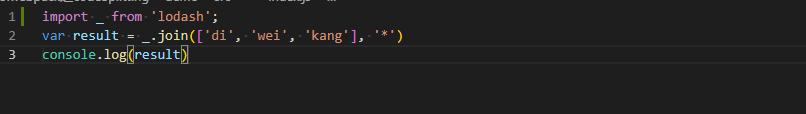
2. 运行命令编译打包
   ```
    npm run build
   ``` 
3. 编译打包输出结果
  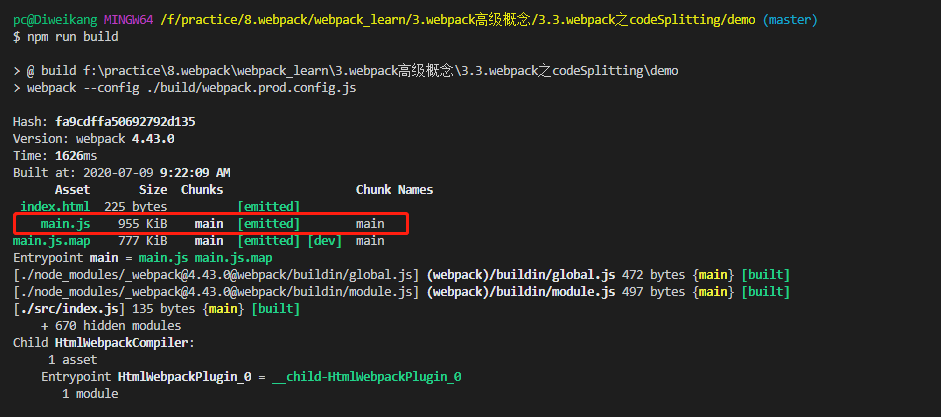
  打包结果中我们看到打包生成的main.js为955KB，其实是将index.js和lodash.js两个文件打包为了一个main.js文件。
4. 弊端
  1. 导致入口文件main.js体积过大，页面的加载速度会很慢。
  2. 当业务代码发生变化重新打包后，又要重新加载整个main.js，其实第三方库是不需要重新加载的。

##### 传统代码拆分
1. 创建index.js文件
  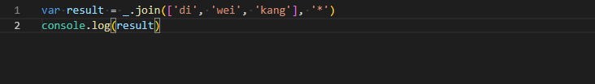
  将lodash的引入从index.js文件中删除
2. 创建lodash.js文件
  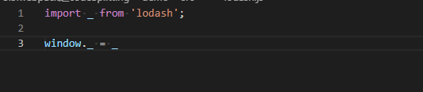
  创建单独的lodash文件，将lodash挂在到window全局对象上。
3. 修改webpack.common.config.js文件
  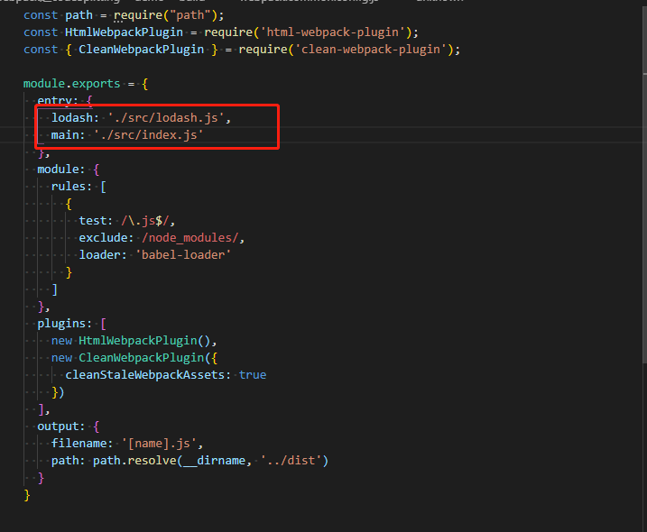
  entry选项配置多入口
4. 编译打包结果
  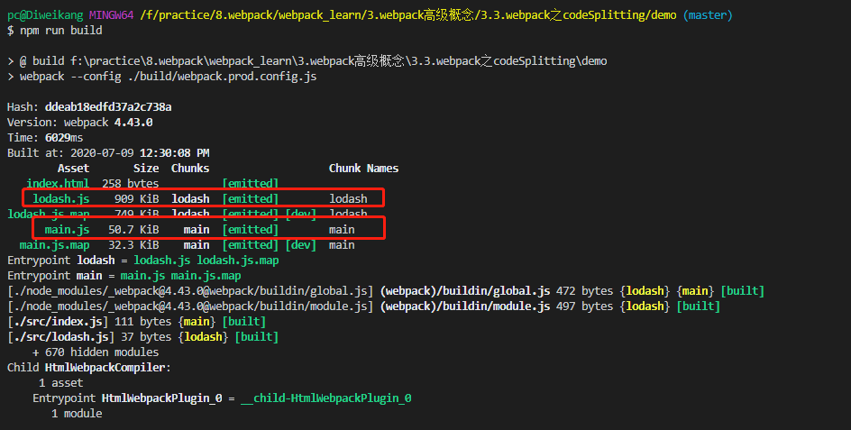
  打包的结果中lodash.js和main.js分别打包，并不像上文中将业务代码和第三方库打包合并到一起，这样页面加载会比代码不拆分更快。

##### webpack配置代码拆分
1. 创建index.js文件
  
2. 删除掉之前创建的lodash.js文件
3. 修改webpack.common.config.js配置
  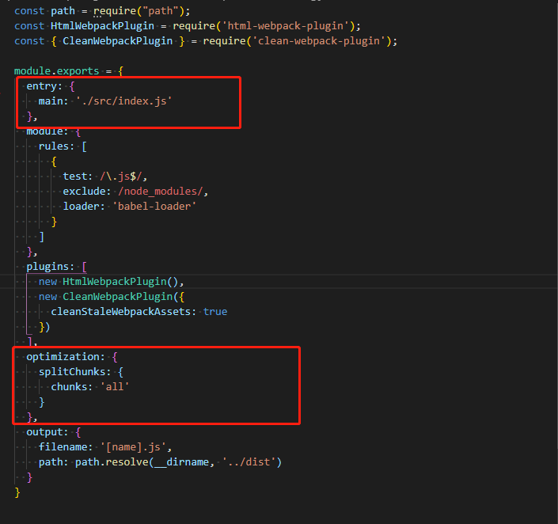
  配置了splitChunks选项，webpack
4. 编译打包结果
  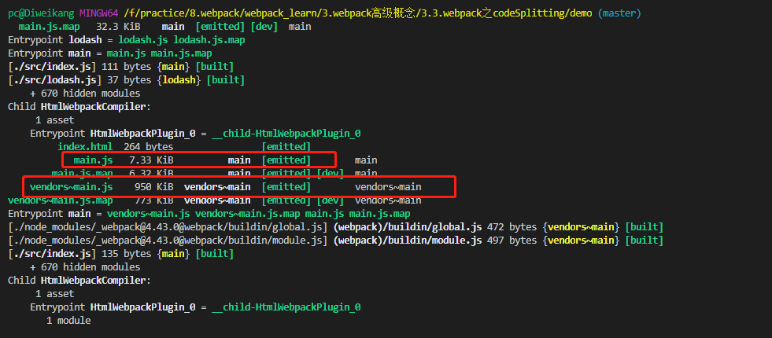
  打包结果中分别生成了mian.js和vendors~main.js文件，业务代码和第三方工具代码也分开打包了。

##### webpack动态引入第三方工具拆分
1. 创建index.js文件
  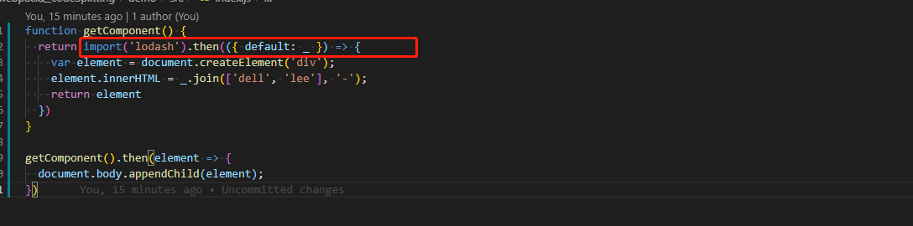
  使用import动态引入依赖模块
2. 修改webpack.common.config.js文件
  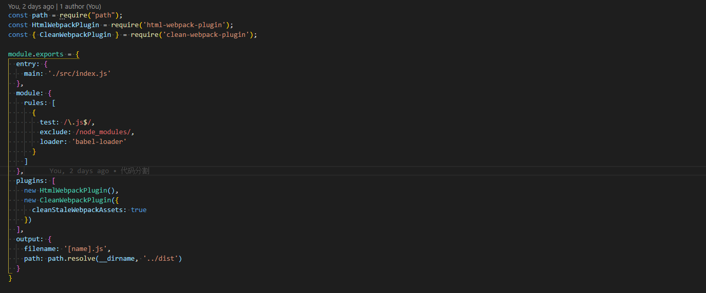
  删除掉了optimization配置项
3. 编译打包结果显示
  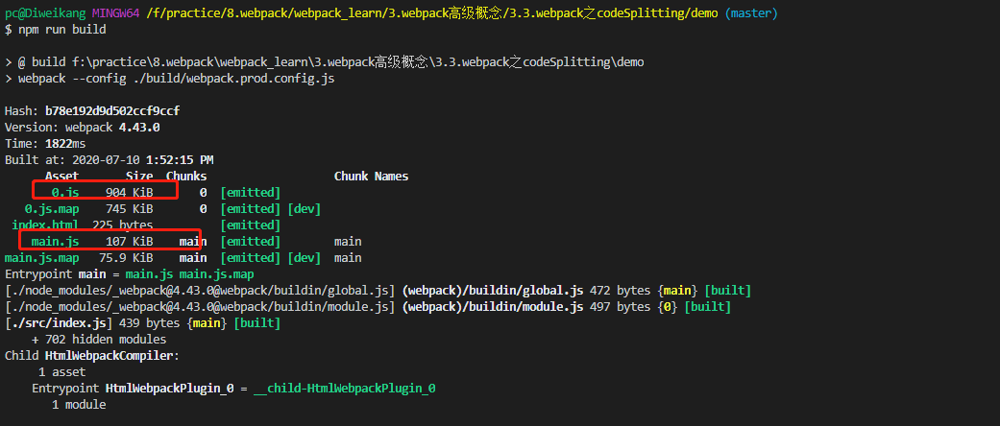
  编译结果中分别生成了0.js和main.js，0.js打包的是第三方库的代码，main.js中打包的是主要的业务代码。

##### webpack常用的三种codeSplitting
  1. webpack的多入口配置
  2. optimization: {splitChunks： { chunks: 'all'}}配置项
  3. 动态import引入，打包时默认会进行代码分包。