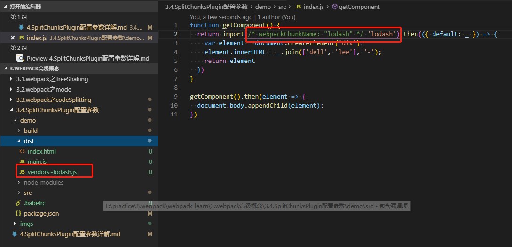
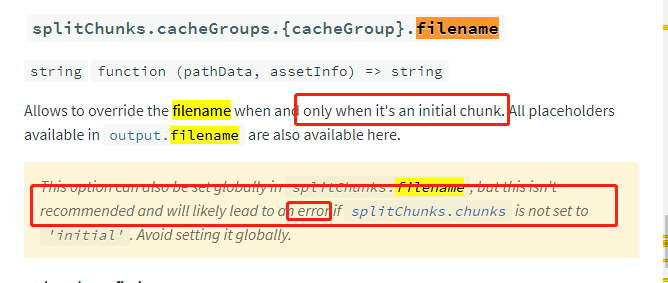

#### webpack中SplitChunksPlugin参数详解
在上一节中已经学习了webpack中的代码拆分，这节主要学习下代码拆分详细的配置参数。
##### 修改打包后文件名称
1. 上节打包后的第三方库名称都是数字，如何修改？
  
2. 修改index文件
  
  在index.js中通过**魔法注释**的方式指定打包后拆分文件的名称为'lodash'，但是打包结果却为'vendors~lodash'，如何让打包的文件名为'lodash'呢？这个时候就需要借助splitChunks配置参数。
3. 修改webpack.common.config.js文件
  
  添加optimization配置项
4. 编译结果中就为lodash.js。
  
  添加optimization配置项后，编译结果中文件名就为lodash.js了。

##### splitChunks配置项详解
- chunks
  chunks取值为'all'、'async'、'initial'
  - all：表示对同步和异步引入的第三方库都可以进行代码拆分打包。
    修改打包后的文件名为'vendors.js'
    - 修改webpack.config.js文件
    
    - 打包结果文件名称修改
    
  - async：表示只对异步引入的第三方库进行代码拆分打包。
    当chunks设置为'async'时，修改index.js中的lodash为同步引入方式，打包时webpack不会对lodash进行单独拆分。
    - 修改index.js文件
      
    - 打包结果
      
  - initial：表示对同步引入的模块进行代码拆分。
- minSize
  表示引入的第三方库大于minSize就进行代码拆分，如果小于minSize设置的值就不进行代码拆分，单位'b'
- maxSize
  如果设置，表示对最后拆分的文件根据设置的大小尝试进行二次拆分。**一般不配置**
- minChunks
  表示需要拆分的模块至少共享X次后才会进行拆分。
- maxAsyncRequests：**一般用默认值**
  - **按需加载时**并行请求的最大数量。
  如果设置同时加载的模块数最多是X个。比如项目中引入了十几个类库，当maxAsyncRequests设置为5时，那么只会对前5个进行代码拆分，后面的就不会再进行代码拆分。
- maxInitialRequests： **一般用默认值**
  - 入口点的最大并行请求数。
  入口文件加载的时候，如果设置最多同时加载的模块数是X个，入库文件做代码拆分也只能拆分出X个，如果超过设置的值就不会在拆分。
- automaticNameDelimiter
  - 表示生成的文件名称中的分隔符，默认为'~'
  
  - 修改分隔符为'-'
    
- cacheGroups
  - vendors
    - test： 表示匹配的文件
    - priority：表示优先级
    - filename: 对打包后的文件重新命名
  - default
    - priority：表示优先级
    - reuseExistingChunk：对打包过的模块不再进行打包，直接进行复用
    - filename：对打包后的文件进行重新命名
  - 当需要拆分的文件不匹配vendors组时，就会被打包到default组。
    - 新建test.js文件，在index.js中引入test.js文件
      
      
    - 修改webpack.common.config.js文件
      
      在cacheGroups配置项中添加default配置组
    - 编译结果
      
    此处的test.js并非是node_modules中，所以最后会打包到default组中。
  - 当需要拆分的文件同时满足vendors和default组时，要根据priority优先级决定，谁priority高就归属那一组。
  - **注意**
    当模块是异步导入的模式时，cacheGroup中filename配置项需要注释掉，否则会报错。
    
##### 总结
  至此关于SplitChunksPlugin中的常用配置参数就学习完了。