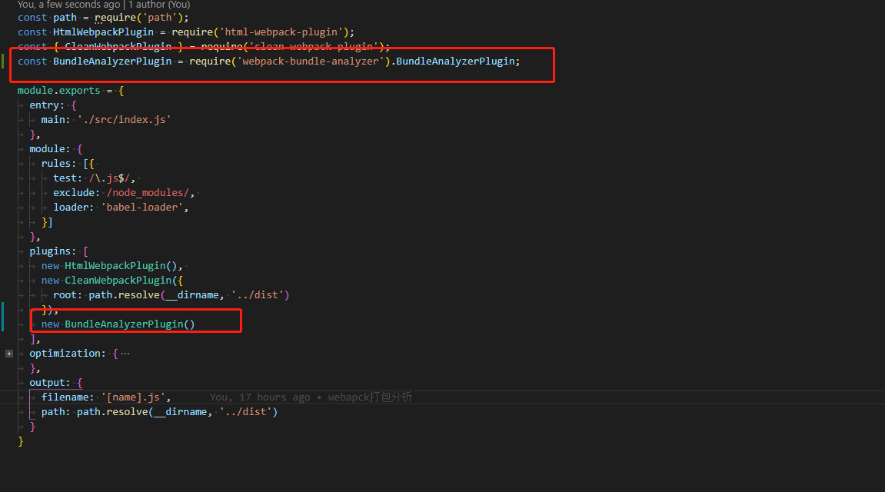
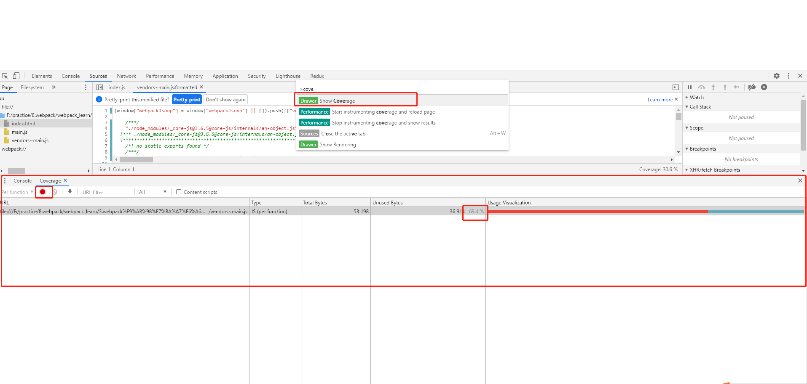
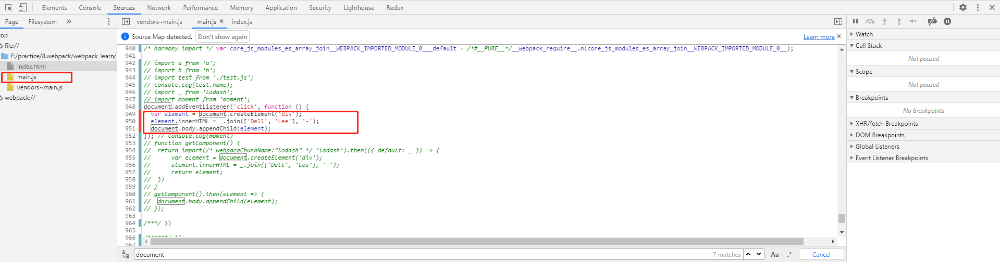

#### webpack中SplitChunksPlugin参数详解
这节主要学习webpack的打包分析及prefetch和preload。
##### webpack-bundle-analyzer插件
我们如何知道我们打包后的结果是否合理呢？这时就需要借助打包分析工具对打包后的模块进行分析。
- 1. 安装webpack-bundle-analyzer插件
  ```
    cnpm install webpack-bundle-analyzer -D
  ```
- 2. 修改webpack.config.js文件，添加webpack-bundle-analyzer插件
  
  在plugins配置项中添加webpack-bundle-analyzer插件
- 3. 编译运行结果
  
  编译之后在浏览器中我们可以看到打包后的结果以更直观的图标显示。

##### 通过Chrome控制台分析页面中代码的利用率
- 在Chrome中打开打包后的index.html文件
- 在console中搜索coverage辅助功能
  按下shift+ctrl+p，然后搜索coverage，然后点击左侧刷新在右侧就能看到页面中代码的利用率。
  
- 点击加载的文件查看加载的源头代码
  
  在加载main.js文件时，标红部分的代码是没有执行的，只有当点击页面的时候才会执行。
  