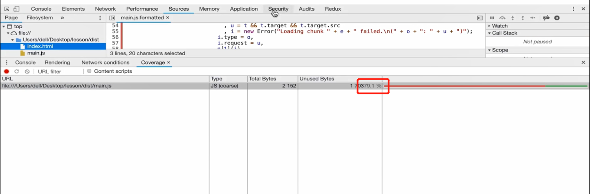

#### webpack打包分析和预加载
这节主要学习webpack的打包分析及prefetch和preload。
##### webpack-bundle-analyzer插件
我们如何知道我们打包后的结果是否合理呢？这时就需要借助打包分析工具对打包后的模块进行分析。
- 1. 安装webpack-bundle-analyzer插件
  ```
    cnpm install webpack-bundle-analyzer -D
  ```
- 2. 修改webpack.config.js文件，添加webpack-bundle-analyzer插件
  
  在plugins配置项中添加webpack-bundle-analyzer插件
- 3. 编译运行结果
  
  编译之后在浏览器中我们可以看到打包后的结果以更直观的图标显示。

##### 通过Chrome控制台分析页面中代码的利用率
- 在Chrome中打开打包后的index.html文件
- 在console中搜索coverage辅助功能
  按下shift+ctrl+p，然后搜索coverage，然后点击左侧刷新在右侧就能看到页面中代码的利用率。
  
  我们可以看到页面代码的利用率只有69.4%。
- 点击加载的文件查看加载的源头代码
  
  在加载main.js文件时，标红部分的代码是没有执行的，只有当点击页面的时候才会执行。

##### 提升页面代码利用率
- 将上例中点击之后才需要执行的代码抽取成单独的模块
  
- 将click.js文件通过动态方式引入
  
- 编译查看页面中代码的利用率
  
  从结果中我们可以看到main.js中的代码利用率提高了。
- **总结**
  从上面的例子中，我们可以发现，通过import()的动态导入方式，可以提升首页代码的加载速度，可以让部分代码达到按需加载的效果，通过这种方式可以对项目进行一定的优化。

##### 预加载
加入网页首页加载时候，首页有登录的入口，点击登录后展示的是登录的弹出框。
  - 1. 当首页加载的时候连同登录的模态框一同加载，这就会导致首页加载的性能变差。
  - 2. 在点击登录的时候再弹出登录模态框，模态框的加载需要时间会让客户有等待的感觉，体验不好。
  - 3. 在首页资源请求完成后，在带宽空闲的时候自动去请求模态框资源，然后当用户点击登录的时候，模态框的资源已经加载好了，就不会有等待的感觉，同时也不会影响首页加载性能。
  - 4. 对于上面这个问题我们可以使用webpack中的**预加载**进行解决。
- prefetching(预获取)
  浏览器在闲置时间请求资源
  - 给index.js中动态导入的click.js添加魔法注释
  
  - 编译后再浏览器查看效果
  0.js会在main.js加载完成后自动去加载，当再点击页面的时候0.js会再次加载，但是它的加载时间明显变短，因为在本地已经有缓存了。
  
- Preloading(预加载)
  会与主业务逻辑资源一起并行加载。
- 总结
  prefetch和proload两种方式，prefetch不会影响核心逻辑文件的加载，而是在浏览器闲置的时候再去加载。所以prefetch会是更好的选择。
