#### webpack高级之浏览器缓存、shimming、环境变量
如何更好的使用浏览器的缓存？
##### 浏览器缓存
- 网站加载的时候会请求相应的资源，浏览器会把资源缓存到本地，如果再次请求同样的资源，浏览器会直接复用本地资源，从而大大提升性能。
##### 避免浏览器缓存
在开发中修改代码打包后的资源部署到服务器上，浏览器上却看不到修改后的内容，经常需要**强刷新**才能看到修改的效果，这就是由于浏览器缓存了原来的资源，重新打包后的资源信息与原来的相同，再次请求时候依然请求的是旧资源。如果解决这个问题呢？我们需要每次打包后的资源信息都不一样。
- 创建idnex.js文件
  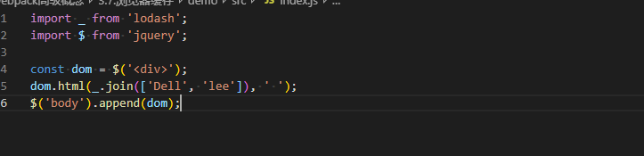
  在index.js中引入了lodash和jquery。
- 编译打包
  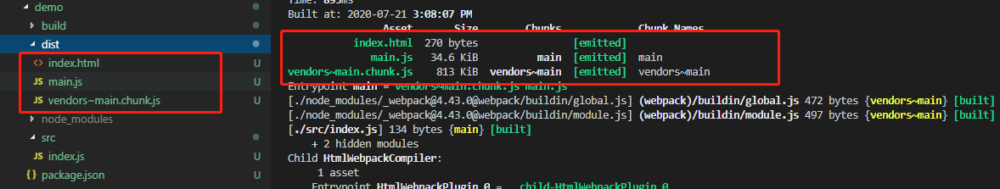
  打包结果生成的dist目录中包含了index.html、main.js、vendors~mian.chunk.js文件，其中index.html是html-webpack-plugin插件生成的，mian.js是index.js中的逻辑代码，vendors~main.chunk.js中打包的是引入的lodash和jquery代码。
- 访问index.html文件
  一般会把生成的dist目录部署到服务器上，此时会请求index.html、main.js、vendors~main.chunk.js文件。
  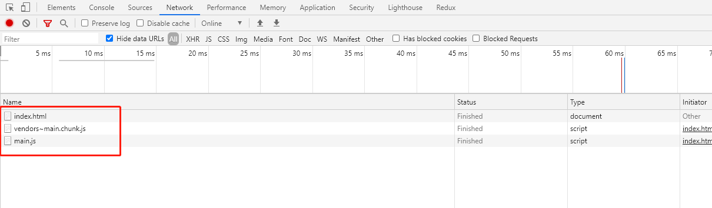
- 此时我们有需求需要改index.js代码
  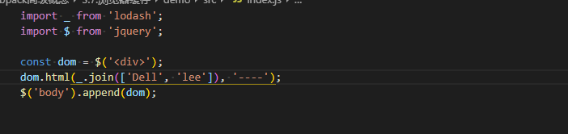
  然后重新编译，生成dist重新进行部署，部署后页面进行普通刷新，发现页面的内容还是原来内容，这就是由于两次编译结果中资源信息相同，再次请求的时候就会使用浏览器缓存的资源。
- 对于**修改后**的资源如何避免使用缓存？
  这个时候就需要借助webpack中contenthash的概念了，如果文件内容修改了，每次生成的contenthash都不一样。
- 修改webpack.config.js
  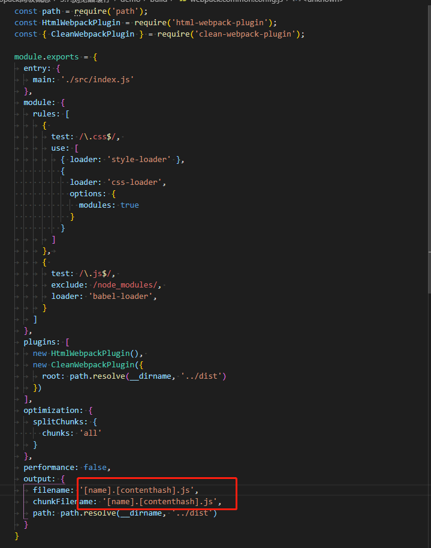
  在output选项中添加contenthash占位符，作为文件唯一性识别符。
- 再次打包部署后**普通刷新**就可以看到代码修改的变化
- 注意：旧版本的兼容
  在旧版本的webpack中，没有修改文件打包后的文件contenthash也有可能不同，需要增加runtimeChunk配置项。
  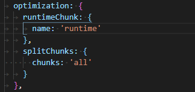
  配置runtimeChunk选项后，旧版本webpack打包也就不会发生问题。

##### shimming
webpack打包过程中进行兼容处理的操作。
##### babel-polyfill
其实之前在学习babel时，对于ES6中的promise等变量方法低版本浏览器是无法识别的，这时候就要借助babel-polyfill处理不同浏览器之间的兼容性。这其实及时一种shimming。
##### 在项目中想引用jquery
- 原始引用
  - 新建一个jquery.ui.js文件
    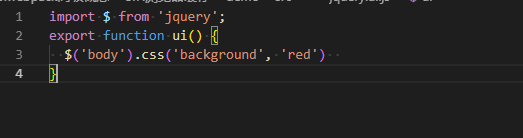
    上例中我们必须引入'jquery'，如果不引入就会报错，但是往往在项目中我们会引入第三方库，而第三方中有可能会引入jquery，再import这种方式就不合理了。这时就需要借助webpack进行配置。
  - 在index.js中引入调用
    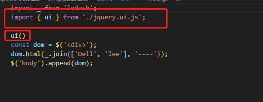
    在index.js中调用导出的ui方法。
- 垫片引用
  - 修改webpack配置
    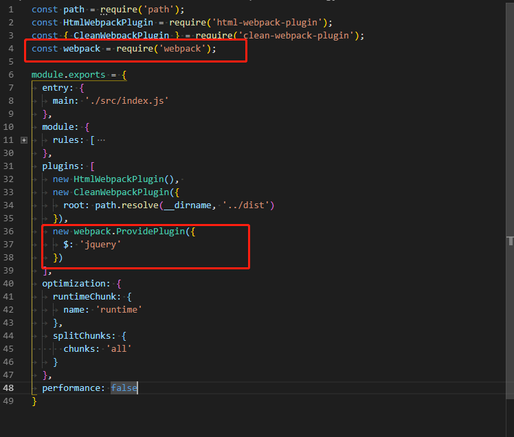
    - webpack打包过程中，如果发现哪个模块使用了\$变量，那么就会在那个模块自动的引入'jquery'，并命名模块的名称为\$。这里配置的webpack插件其实就是一个'垫片'
  - 修改jquery.ui.js
    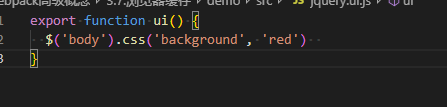
    删除掉jquery.ui.js文件中引入的jquery模块。
  - 再编译查看结果
    
    我们可以看到编译结果依然正确。
##### 在项目中引用lodash的方法
- 修改index.js文件
  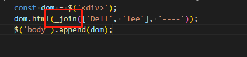
- 修改webpack配置
  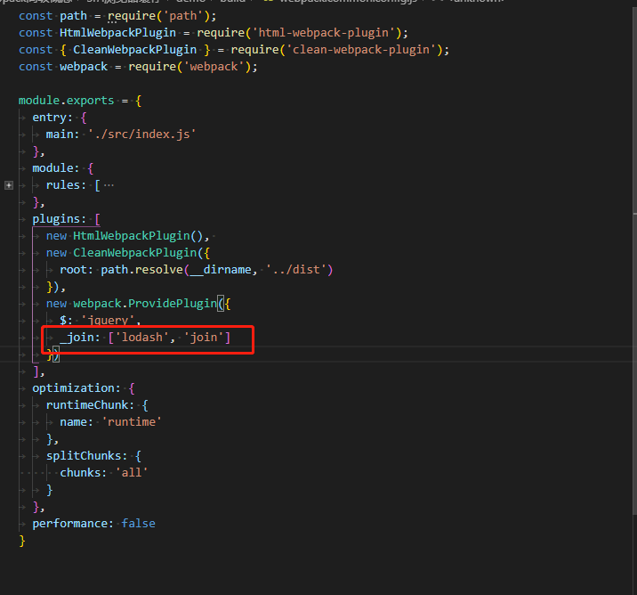
  引入lodash的join方法以数组的形式。

##### 修改this的指向
模块中全局环境的this指向的是模块本身，如果我们想让模块指向window，如何处理呢?
- 模块中的this
  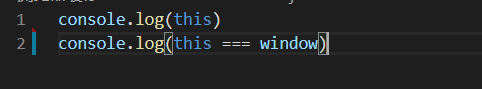
  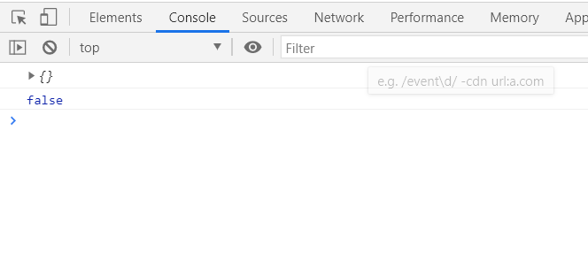
  上例中我们看到模块中的this并非指向window。
- 修改模块中this的指向
  - 安装imports-loader
  ```
    npm install imports-loader -D
  ```
  - 修改webpack配置
  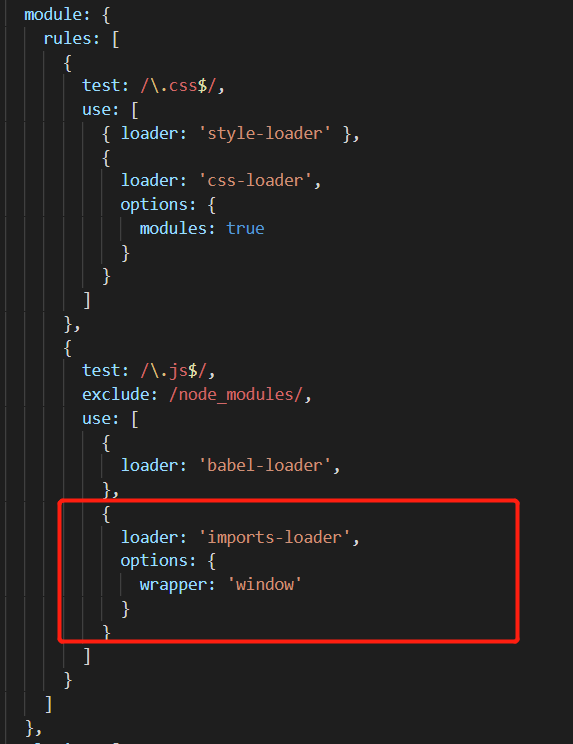
  - 编译后结果
  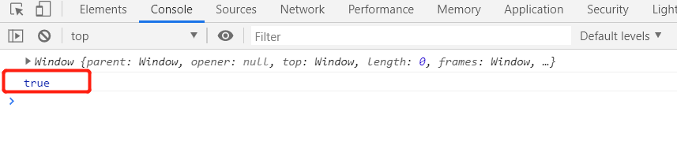

- 至此关于webpack中的shimming我们就学习这么多，更多参考官方文档。